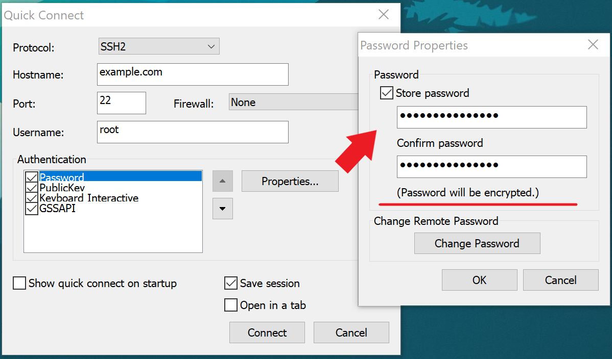

# How Does SecureCRT Encrypt Password?

## 1. What is SecureCRT?

SecureCRT is a commercial SSH and Telnet client and terminal emulator by VanDyke Software. 

Originally a Windows product, VanDyke has recently added a Mac OS X version and Linux version.

## 2. What does indicate that SecureCRT encrypts password?

If you use SecureCRT to manage your SSH/Telnet clients, the first thing you should do is to create a connection to one of your clients. So that means you should fill something in the picture below with hostname, username, port and, important, password.

<div align="center">
    
</div>

As you can see, SecureCRT says "Password will be encrypted."

So where does the encrypted password store?

Generally, it should be stored in the file named `<Hostname>.ini` under the folder `%APPDATA%\VanDyke\Config\Sessions`. 

For example

```
%APPDATA%\VanDyke\Config\Sessions\example.com.ini
```

Open the file, you can see there is a line looking like

```
S:"Password"=u17cf50e394ecc2a06fa8919e1bd67cf0f37da34c78e7eb87a3a9a787a9785e802dd0eae4e8039c3ce234d34bfe28bbdc
```

or

```
S:"Password V2"=02:7b9f594a1f39bb36bbaa0d9688ee38b3d233c67b338e20e2113f2ba4d328b6fc8c804e3c02324b1eaad57a5b96ac1fc5cc1ae0ee2930e6af2e5e644a28ebe3fc
```

if your SecureCRT's version is after 7.3.3

That is the encrypted password. And the following will introduce how SecureCRT encrypts password.

## 3. How does SecureCRT encrypt password?

SecureCRT has two algorithms to encrypt passwords in session files. 

One is used in SecureCRT whose version is prior to 7.3.3. I name it "Password" for the ciphertext is always placed behind the field `"Password"`.

The other is used from SecureCRT 7.3.3. I name it "Password V2" for the ciphertext is always placed behind the field `"Password V2"`.

### 3.1 "Password" algorithm

Reference: [SecureCRT-decryptpass.py](https://github.com/gitPoc32/Forensic/blob/master/VanDykeSecureCRT/SecureCRT-decryptpass.py)

This algorithm uses two Blowfish-CBC cipher: `cipher1` and `cipher2`. 

The IVs(Initial Vectors) of two ciphers are both 

```c
uint8_t IV[8] = {
    0x00, 0x00, 0x00, 0x00, 0x00, 0x00, 0x00, 0x00
}
```

The key for `cipher1` is

```c
uint8_t Key1[16] = {
    0x24, 0xa6, 0x3d, 0xde, 0x5b, 0xd3, 0xb3, 0x82, 
    0x9c, 0x7e, 0x06, 0xf4, 0x08, 0x16, 0xaa, 0x07
}
```

The key for `cipher2` is

```c
uint8_t Key2[16] = {
    0x5f, 0xb0, 0x45, 0xa2, 0x94, 0x17, 0xd9, 0x16, 
    0xc6, 0xc6, 0xa2, 0xff, 0x06, 0x41, 0x82, 0xb7
}
```

The encryption pipeline is


And the decryption pipeline is


### 3.2 "Password V2" algorithm

This algorithm uses a AES256-CBC cipher: `cipher`. The IV(Initial Vector) is

```c
uint8_t IV[16] = {
    0x00, 0x00, 0x00, 0x00, 0x00, 0x00, 0x00, 0x00,
    0x00, 0x00, 0x00, 0x00, 0x00, 0x00, 0x00, 0x00
}
```

The key is the SHA256 digest of UTF-8 encoded config passphrase which is set when SecureCRT runs at the first time. If config passphrase is not set, the key is the SHA256 digest of empty string:

```c
uint8_t Key[32] = {
    0xe3, 0xb0, 0xc4, 0x42, 0x98, 0xfc, 0x1c, 0x14, 
    0x9a, 0xfb, 0xf4, 0xc8, 0x99, 0x6f, 0xb9, 0x24, 
    0x27, 0xae, 0x41, 0xe4, 0x64, 0x9b, 0x93, 0x4c, 
    0xa4, 0x95, 0x99, 0x1b, 0x78, 0x52, 0xb8, 0x55
}
```

The encryption pipeline is


And the decrytion pipeline is


